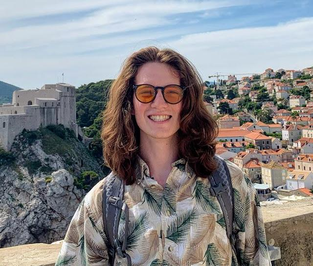

@def title = "Home"
@def date = Date(2023, 06, 07)

## About me
@@row
@@container
~~~

~~~

Hello. My name is Nikola Janjušević. I am a fourth year **PhD candidate in
Electrical Engineering** at *New York University* under the advisory of
Professor Yao Wang, [NYU VideoLab](https://wp.nyu.edu/videolab/). I
received my Bachelors in Electrical Engineering from *The Cooper Union for Advancement of
Science and Art* in 2019.

My current interests are in *interpretable deep-learning* models for solving
*inverse-problems* and low-level *computer-vision*/*image-processing* tasks. My
background is in *signal-processing* and *non-smooth, convex optimization*.
Outside of academia, I go biking and skateboarding with my friends.
@@
@@

## Updates
* June 2023: [*"Fast and Interpretable Nonlocal Neural Networks for Image Denoising via Group-Sparse Convolutional Dictionary Learning"*](https://arxiv.org/abs/2306.01950) submitted to IEEE Transactions on Image Processing. Preprint available on arxiv.

## Recent blog posts
{{recentposts blog}}
