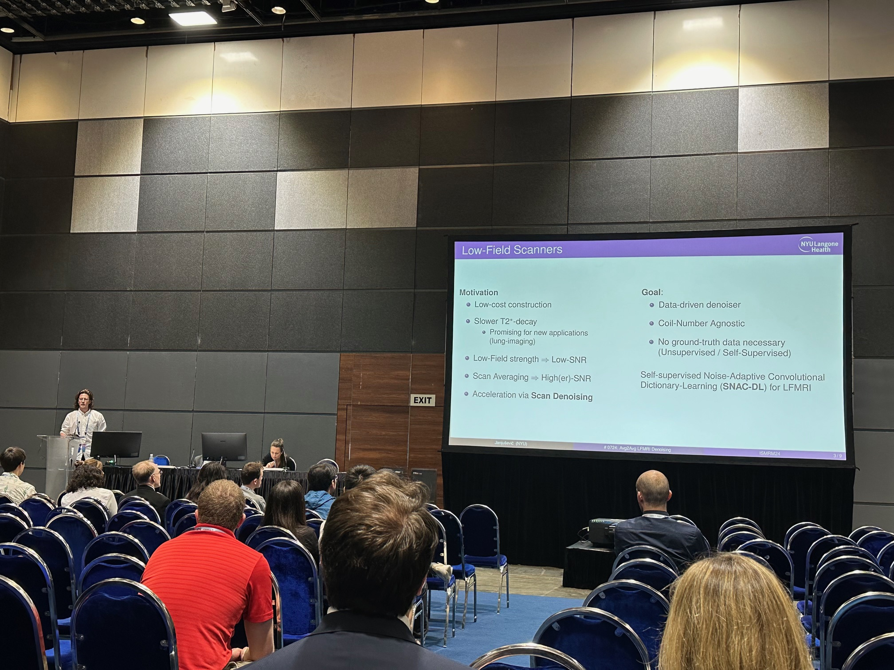
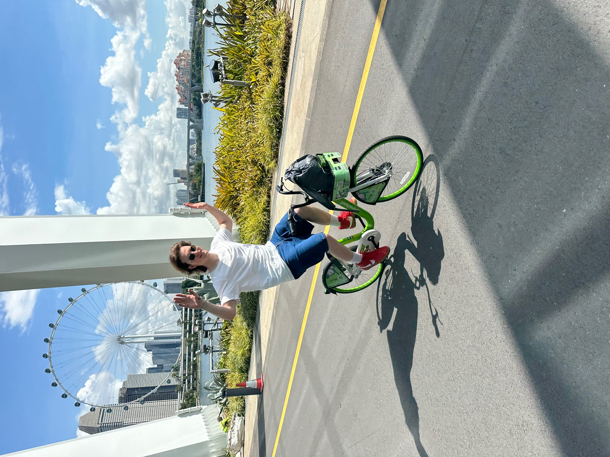

@def title = "Nikola"
@def date = Date(2023, 06, 07)

## About me
@@row
@@container
~~~

~~~

Hello. My name is Nikola Janjušević. I am a fifth year **PhD candidate in
Electrical Engineering** at *New York University* under the advisory of
Professor Yao Wang, [NYU VideoLab](https://wp.nyu.edu/videolab/). I
received my Bachelors in Electrical Engineering from *The Cooper Union for Advancement of
Science and Art* in 2019.

My current interests are in *interpretable deep-learning* models for solving
noisy *inverse-problems* without ground-truth data. My
background is in *signal-processing* and *non-smooth, convex optimization*.
Outside of academia, I go biking and skateboarding with my friends.
@@
@@

## Updates
* [May 27th 2024] Gave a talk in Belgrade: [*Strategija Razvoja Veštačke Inteligencije Kod Nas*/*An Artificial Inteligence Strategy for Serbia*](https://www.vos.edu.rs/strategija-razvoja-vestacke-inteligencije-vest28-05-2024/), Eduka Institute of Organizational Business.
@@container
~~~

~~~
@@

* [May 9th 2024] Presented at [ISMRM 2024](https://www.ismrm.org/24m/) in Singapore!
    - *"Advanced Deep Learning Denoising for Accelerated 0.55T Prostate MRI"* (Power-Pitch + Digital Poster Presentation)
    - *"SNAC-DL: Self-Supervised Network for Adaptive Convolutional Dictionary Learning of MRI Denoising"* (Digital Poster Presentation)
@@container
~~~

~~~
@@

## Recent blog posts
{{recentposts blog}}
